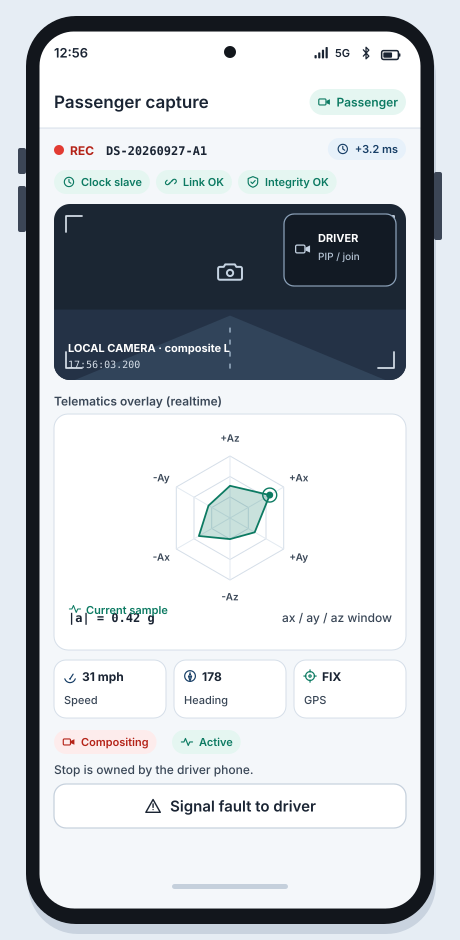

# WF-05 Passenger capture + spider graph

**Platform:** Android  
**Storyboards:** SB-03  
**Artifact:** ART-RIDE-UX-001

<!-- wireframe-svg:start -->

## Visual wireframe

Realistic SVG mock with inline icon paths. The ASCII block below stays the structural spec.



[Open WF-05-passenger-capture-spider.svg](../assets/wireframes/WF-05-passenger-capture-spider.svg)

<!-- wireframe-svg:end -->


```
+--------------------------------------+
|  Passenger capture            Role:P |
+--------------------------------------+
|  REC *  DS-20260927-A1   offset +3ms |
|  Clock slave | Link OK | Integrity OK|
|                                      |
|  +------------------+  +-----------+ |
|  |                  |  | DRIVER    | |
|  |  LOCAL CAMERA    |  | PIP/JOIN  | |
|  |  (composite L)   |  | stream    | |
|  |                  |  +-----------+ |
|  |                  |                |
|  +------------------+                |
|                                      |
|  Telematics overlay (realtime)       |
|  +--------------------------------+  |
|  |        N                       |  |
|  |     \  |  /     spider graph   |  |
|  |   ---(+ )---   ax/ay/az window |  |
|  |     /  |  \                    |  |
|  |        S     |a|= 0.42 g       |  |
|  +--------------------------------+  |
|  spd 31 mph   hdg 178   gps FIX      |
|                                      |
|  Status: COMPOSITING / ACTIVE        |
|  Stop is owned by DRIVER phone       |
|  [ Signal fault to driver ]          |
+--------------------------------------+
```

## Behavior

- No Start/Stop primary controls on passenger while admitted.
- Overlay timestamps use shared session clock.
- Camera loss or desync beyond threshold -> WF-08 and notify driver.
- On STOP from driver -> WF-06 seal of composite.
