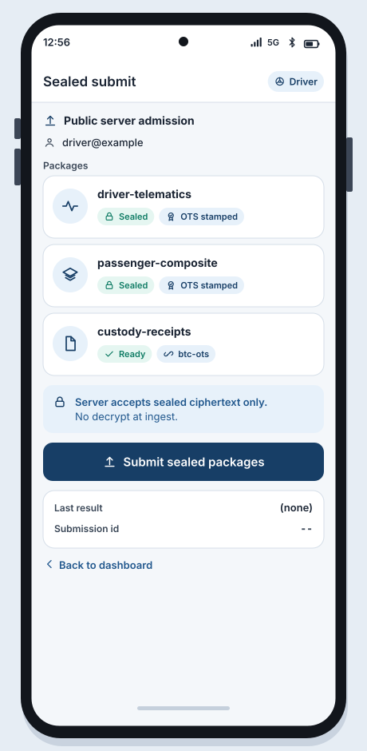

# WF-07 Submit status

**Platform:** Android (driver orchestrates)  
**Storyboards:** SB-05  
**Artifact:** ART-RIDE-UX-001  
**API:** ART-RIDE-API-001 sealed-only

<!-- wireframe-svg:start -->

## Visual wireframe

Realistic SVG mock with inline icon paths. The ASCII block below stays the structural spec.



[Open WF-07-submit-status.svg](../assets/wireframes/WF-07-submit-status.svg)

<!-- wireframe-svg:end -->


```
+--------------------------------------+
|  Sealed submit                Role:D |
+--------------------------------------+
|  Public server admission             |
|  Account: driver@example            |
|                                      |
|  Packages                            |
|  +--------------------------------+  |
|  | driver-telematics   SEALED OK  |  |
|  | Integrity OK   OTS stamped     |  |
|  +--------------------------------+  |
|  +--------------------------------+  |
|  | passenger-composite SEALED OK  |  |
|  | Integrity OK   OTS stamped     |  |
|  +--------------------------------+  |
|  +--------------------------------+  |
|  | custody-receipts    READY      |  |
|  | chain: btc-ots                 |  |
|  +--------------------------------+  |
|                                      |
|  Server: sealed ciphertext only      |
|  No decrypt at ingest                |
|                                      |
|  [ SUBMIT SEALED PACKAGES ]          |
|                                      |
|  Last result: (none)                 |
|  Submission id: --                   |
|                                      |
|  [ Back to dashboard ]               |
+--------------------------------------+
```

## Behavior

- Submit disabled if any package unsealed, Integrity FAIL, or OTS policy unmet.
- On admit: show submission id and counsel viewer hint (SB-06).
- On reject: reason code -> WF-08.
